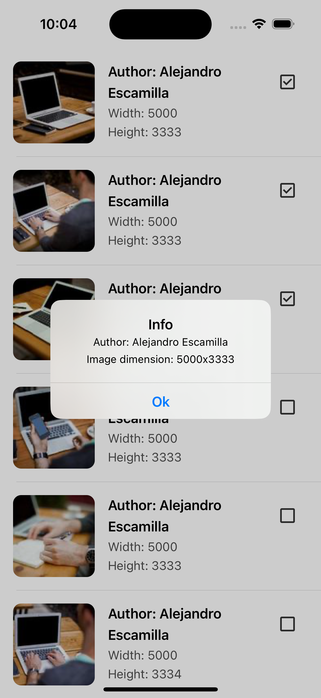

# LoremPicsum

- LoremPicsum is an iOS app that fetches and displays images from the [Lorem Picsum](https://picsum.photos) API.
- This app was developed as a coding round task.

## Features
- Displays a list of photos fetched from the Lorem Picsum API.
- Pull-to-refresh functionality to reload the list.
- Pagination support for loading more photos as the user scrolls.
- Image caching using NSCache.
- Programmatic UI.
- MVVM-C architecture.
- Minimum iOS deployment target: 12.0.

## Screenshots

 
  
 

## Technologies Used
- Swift 5
- UIKit
- Xcode 15.3

## Getting Started
1. Clone this repository.
2. Open `LoremPicsum.xcodeproj`.

## Task Requirements
Create an application with following specifications
1. A Splash screen with white background and desired image in centre
2. After 5 secs , from splash screen user has to be navigated to a page which has a Tableview
3. In Tableview page , each row will have a image , Title, description and checkbox (checkbox should be clickable by user and checkbox data should handled when table view scroll)
4. Each row should be the right height to display its own content and no taller. No content should be clipped. This means some rows will be larger than others.
5. Don't download all images at once, only as needed .
6. Refresh function, either a refresh button or use pull down to refresh. 
7. On click of each cell, if checkbox is enabled display a dialog which shows the description else if checkbox is disabled display a alert.
 
Guidelines
1. Use Git to manage the source code. A clear Git history showing your process is required.
2. Structure your code according to industry best practice design patterns.
3. Scrolling the Tableview should be smooth, even as images are downloading and getting added to the cells.
4. Comment your code when necessary.
5. Commit your changes to git in small chunks with meaningful comments.
 
iOS:
1. Support should be from iOS 12.0 to latest
2. You can use any tags from api to display title and description . Ex: Author and url
3. Pull to refresh will refresh the tableview. It means same data. Add pagination if possible by changing the page no in api which gives next set of data.
 
API:
https://picsum.photos/v2/list?page=2&limit=20
